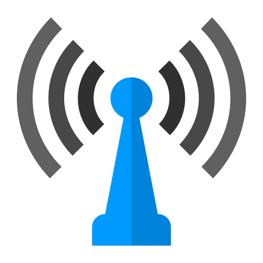

# Antenna

__The React client for @sphinx-software/station__

[](https://www.npmjs.com/package/@sphinx-software/antenna) [](https://standardjs.com)

## Install

```bash
npm install --save @sphinx-software/antenna
```

## Setup

To start using this library, you'll need initialize a firebase application at first.


```jsx
import React from 'react'
import firebase from 'firebase/app'
import 'firebase/firestore'
import 'firebase/auth'

const firebaseApp = firebase.initializeApp({})
```


Now, let's create a `firestore` transport

```jsx
import { firestore } from '@sphinx-software/antenna'
///

export default firestore({
  firebase: firebaseApp,
  handshake: async () => {
    // Resolve to firebase custom token here.
    // Usually, you'll make an API call.
    return customToken
  },

  authorize: async (channel) => {
    // Request subscription permission to the server
  }
})
```

## Initialize Antenna by `AntennaProvider`

Wrap your React application by `AntennaProvider` component


```jsx
import { AntennaProvider } from '@sphinx-software/antenna'
import transport from './transport'

/// App component

const App = () => {

  return (
    <AntennaProvider
      transport={transport}
      fallback={<div>Signaling ...</div>}
    >
      {/* Your application code  */}
    </AntennaProvider>
  )
}
```

Now, you are ready to receive the signal 📡

## Subscribe to a channel with `useAntenna` hook

```jsx
import { useAntenna } from '@sphinx-software/antenna'
import React, { useEffect, useState } from 'react'

export default () => {

  const antenna = useAntenna()
  const [lastMessage, setLastMessage] = useState(null)

  useEffect(() => {
    return antenna.subscribe('channel-name', (message) => setLastMessage(message))
  }, [antenna])

  return (
    <div>
      {JSON.stringify(lastMessage)}
    </div>
  )
}
```

__⚠️ IMPORTANT__

___Components using the `useAntenna` hook __will be suspended__ while the antenna is authorizing your app.
Remember to wrap it with `Suspense` component to prevent errors.___

## Using the `Subscription` component

In real world application, you will have to manage rather complex state than the above demo. 
This is where the `Subscription` component shining.  

`Subscription` component can automatically subscribe & unsubscribe to a channel - thanks to `useEffect` hook.
Each subscription will have its own state, and can update the state according to the message it received.
You have complete control over that state by providing a reducer to it. 

### Let's define your subscription reducer

```jsx
// chatReducer.js
export default (state, action) => {
   switch (action.type) {
      // ...
      // When transport receives a message, it will dispatch an action with this format: { type: 'the message type', payload: { ... the message payload }}
      case 'chat.message': {
        return {
          ...state,
          unreads: [...state.unreads, action.payload],
          messages: [...state.messages, action.payload]
        }
      }

      case 'chat.join': {
        return {
          ...state,
          members: [...state.members, action.payload]
        }
      }

      case 'chat.leave': {
        return {
          ...state,
          members: state.members.filter(member => member.id !== action.payload.id)
        }
      }

      // You can certainly define your custom action type
      case 'chat.markAsRead': {
        return {
          ...state,
          unreads: state.unreads.filter(message => message.id !== action.messageId)
        }
      }
      default: return state
   }
}
```

### Then we can provide a subscription to the channel

```jsx
// Chat.js
import React, { Suspense } from 'react'
import { Subscription } from '@sphinx-software/antenna'
import chatReducer from './chatReducer'

const INITIAL_CHAT_STATE = { unreads: [], members: [], messages: [] }

export default () => {
  return (
    <Suspense fallback='...'>
        <Subscription channel='channel_chat' initialState={INITIAL_CHAT_STATE} reducer={chatReducer}>
          {/*  TODO  */}
        </Subscription>
    </Suspense>
  )
}
```

__⚠️ IMPORTANT__

___`Subscription` component __will be suspended__ while the antenna is authorizing your app.
Remember to wrap it with `Suspense` component to prevent errors.___

### Interacting with subscription state

You can use the `useSubscription` hook to interact with the subscription state

```jsx
import React from 'react'
import { useSubscription } from '@sphinx-software/antenna'

const Messages = () => {
  const [ state, dispatch ] = useSubscription()
  return (
    <ul>
      {
        state.messages.map(message => {
          return (
            <li
              onClick={() => dispatch({ type: 'chat.markAsRead', messageId: message.id})}
              key={message.id}>{message.content}
            </li>
          )
        })
      }
    </ul>
  )
}
```

Then place your `Messages` component into the `Subscription` context:


```jsx
// Chat.js
import React, { Suspense } from 'react' 
import { Subscription } from '@sphinx-software/antenna'
import chatReducer from './chatReducer'
import Messages from './Messages'

const INITIAL_CHAT_STATE = { unreads: [], members: [], messages: [] }

export default () => {
  return (
    <Suspense fallback='...'>
        <Subscription channel='channel_chat' initialState={INITIAL_CHAT_STATE} reducer={chatReducer}>
          {/*  Place your Messages component here  */}
          <Messages/>
        </Subscription>
    </Suspense>
  )
}
```

You also can use the `Subscriber` HoC to archive the same functionality
```jsx
const Messages = ({ state, dispatch }) => {
  return (
    <ul>
      {
        state.messages.map(message => {
          return (
            <li
              onClick={() => dispatch({ type: 'chat.markAsRead', messageId: message.id})}
              key={message.id}>{message.content}
            </li>
          )
        })
      }
    </ul>
  )
}
```


```jsx
// Chat.js
import React, { Suspense } from 'react' 
import { Subscription, Subscriber } from '@sphinx-software/antenna'
import chatReducer from './chatReducer'
import Messages from './Messages'

const INITIAL_CHAT_STATE = { unreads: [], members: [], messages: [] }

export default () => {
  return (
    <Suspense fallback='...'>
        <Subscription channel='channel_chat' initialState={INITIAL_CHAT_STATE} reducer={chatReducer}>
          {/*  Place your Messages component here  */}
          <Subscriber component={Messages} />
        </Subscription>
    </Suspense>
    
  )
}
```

> 💡
> 
> Since `Subscription` has its state, you can consider it as a __boundary__ of the channel data (the Subscription state).
> Its child component can and should be well aware about such data.
>
> You can add as many `Subscriber` as you want inside a `Subscription`.
>
> You can have multiple `Subscription` components sharing the same channel. 
> All of them will receive messages from the channel. 
> This approach is very useful when you want to have various ways of presenting the channel data.

That's all! Happy signaling ❤️

## License

MIT © [monkey-programmer](https://github.com/monkey-programmer)
